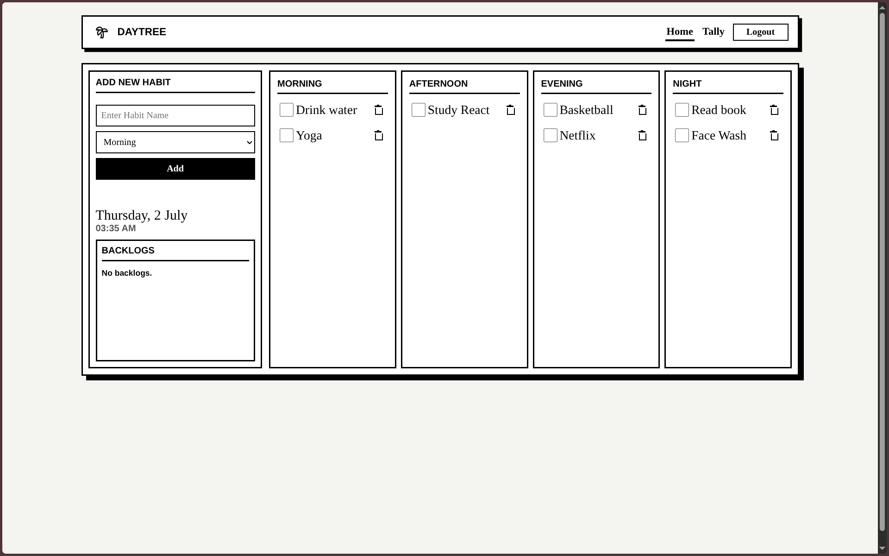

# 🌿 DayTree

DayTree is a professional, production-ready MERN habit tracking application designed around daily execution, period-based scheduling, and long-term consistency metrics. 

It is constructed with a highly structured, feature-based architecture and features a striking, minimal Brutalist design.

---

## 📸 Screenshots & Previews

### 1. Habit Dashboard (Daily Board)


### 2. Secure Authenticated Gate


---

## ✨ Features

* **Brutalist Monospaced UI**: A bold, clean, accessibility-compliant monochrome layout that prioritizes usability.
* **Period-Based Habit Tracking**: Organize habits into dedicated time blocks (Morning, Afternoon, Evening, Night) to structure your daily routine.
* **Unified Analytics Engine**: Computes daily averages, completion streaks, and compiles dynamic heatmap metrics directly on the server to prevent heavy frontend CPU utilization.
* **Intelligent Backlog Detection**: Automatically lists past habits that were missed during their designated time window to encourage user catch-ups.
* **Robust Security Controls**: Protected routes, JWT token session management, Helmet headers, express body-size protection (100kb limit), and custom MongoDB operator sanitizers to guard against script injections.
* **Granular IP Rate Limiter**: Enforces strict endpoint throttling (100 requests / 15 minutes globally; 15 requests / 15 minutes for security-critical Auth/Multer endpoints).
* **Observability & Request Tracing**: Assigns and appends UUID request-tracking headers (`X-Request-Id`) across logs, error responses, and audit hooks.

---

## 🛠 Tech Stack

### Frontend
* **Core**: React 19, Vite, Javascript
* **Routing**: React Router DOM (v7)
* **Styling**: Vanilla CSS (Custom Brutalist Monochrome design tokens)

### Backend
* **Core**: Node.js, Express.js
* **Database**: MongoDB Atlas, Mongoose
* **Auth**: JWT, bcrypt
* **File Upload**: Multer, Cloudinary API
* **Security & Observability**: Helmet, Express Mongo Sanitize, Express Rate Limit, UUID Request Tracer, Audit Service logger
* **Testing**: Jest, Supertest (28 comprehensive integration test specs)

---

## 📁 Repository Directory Structure

```text
daytree/
├── .github/                 # GitHub workflows & issue/PR templates
├── backend/                 # Node & Express microservice folder
│   ├── src/
│   │   ├── config/          # Central configuration (DB, Cloudinary, Env)
│   │   ├── controllers/     # Controller handlers (Auth, Habits, Users, Tally)
│   │   ├── middleware/      # Global hooks (Auth guard, Rate Limiter, Error Handler, Tracer)
│   │   ├── models/          # Database models (User, Habit, HabitCompletion)
│   │   ├── routes/          # Router paths mapping endpoints to controllers
│   │   ├── services/        # Decoupled business engines (Tally calculations)
│   │   ├── utils/           # Shared response formats & helpers
│   │   ├── validators/      # Route parameter Zod schemas
│   │   ├── app.js           # Express app configuring middleware & routing
│   │   └── server.js        # Server bootstrapping & OS signal listeners
│   ├── tests/               # Sequential Supertest integration suite
│   ├── .env.example         # Template for environment variables
│   └── package.json         # Backend dependency lock
├── public/                  # Static assets & brand graphics
├── src/                     # React Single Page Application (SPA) source
│   ├── app/                 # Providers, layout templates, routing guards
│   ├── features/            # Feature-focused modules (Auth, Habits, Tally pages)
│   └── shared/              # Reusable generic widgets, helpers, constants
├── API.md                   # Full endpoint parameter specifications
├── DEPLOYMENT.md            # Render/Vercel/Atlas cloud manual
├── LICENSE                  # MIT License
└── package.json             # Root dependency configuration
```

---

## 🚀 Local Quickstart

### Prerequisites
* [Node.js](https://nodejs.org/) (v18+)
* [Docker Desktop](https://www.docker.com/) (to run local MongoDB container)

### 1. Database Setup
Spin up a local MongoDB container:
```bash
# Pull and start MongoDB
docker run -d --name daytree-mongo -p 27017:27017 mongo:latest
```

### 2. Backend Installation & Start
Navigate to the backend, set up environment secrets, and run in dev mode:
```bash
cd backend
npm install
cp .env.example .env

# Run development server
npm run dev
```

### 3. Frontend Installation & Start
Open a new terminal window in the root project folder:
```bash
# Install dependencies
npm install

# Start Vite dev server
npm run dev
```
Open [http://localhost:5173/](http://localhost:5173/) in your web browser.

### 4. Running Backend Tests
Execute the automated Supertest validation suite:
```bash
cd backend
npm test
```

---

## ☁️ Deployment Specifications

* **Database**: MongoDB Atlas Cluster.
* **Backend**: Deployed to Render (utilizes `trust proxy: 1` settings to read client IPs safely behind load balancers).
* **Frontend**: Deployed to Vercel (points to the Render domain using the environment variable `VITE_API_BASE_URL`).

For detailed instructions on cloud deployment, reference the [DEPLOYMENT.md](DEPLOYMENT.md) guide.

---

## 🗺 Future Roadmap
* **Habit Reminders**: Support push notifications and email integrations.
* **Personal Goals**: Expose user custom goals and target streaks.
* **Visual Themes**: Toggle support for brutalist color matrices (e.g. amber, emerald neon).

---

## 📄 License
This project is open-source software licensed under the [MIT License](LICENSE).
